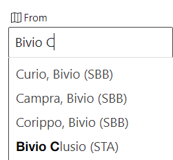
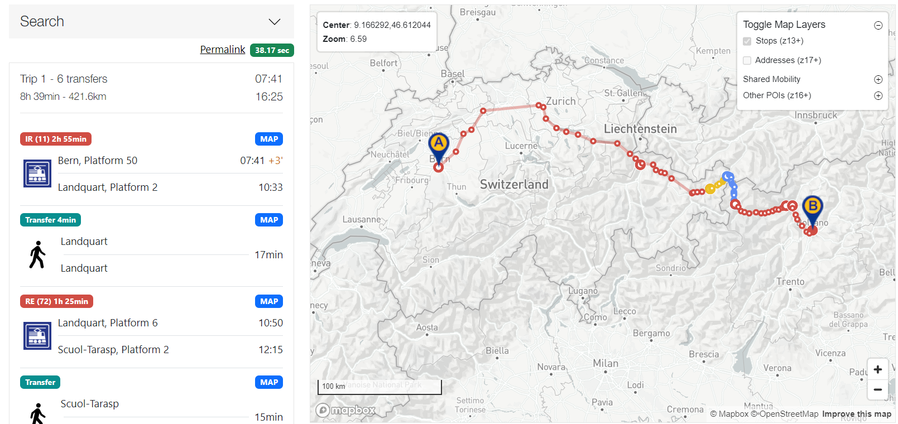
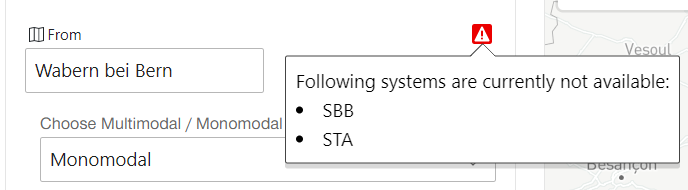

# Features

## LocationInformationRequest

When entered more than one letter into the search field in the frontend it will trigger this request.
The result are locations with the originSystem. Those locations are ordered with the probability property 
provided by the backend systems. See also [probability tweaking](#probability-tweaking).

### Limitations

The server only will look on the provided "initial Input", nothing else.

### Probability tweaking

The probability from STA is way lower than the one from SBB. Therefore, a constant is added to all the locations from STA.
This constant can be changed in the [config](./src/config/index.ts) and is named `STA_SEARCH_TWEAK`.

## TripRequest

The TripRequest delivers a TripResult from the origin to the destination location. 
This works if both locations are in the same system and also if they are in a different one.

### Limitations

The server only works with the provided StopPlaceRef of the two locations, the prefetched ExchangePoints(EP), the
NameToSystem- as well as the NameToLocation-mapping. Every other parameter in the request is ignored. This is a result of the limited functionality
of the ojp-sdk. NameToSystemMapper and NameToLocationMapper can be omitted in the future if the frontend sends the origin-system
and the geoLocation additional to the StopPlaceRef.

### Link Projection

Normally the resolution of a trip on the map is really high. For the mapping (xml->ts->xml) the server has to loop over
all those points and this makes it really slow. Therefore, the server only works with a way lower resolution.
This setting can be re-enabled in [config](./src/config/index.ts) and is named `WITH_LINK_PROJECTION`.

### Mono-modal Journey

As written above, the server will ignore most of the request parameters and therefore only will perform Monomodal Journeys 
with the Mode of Transport `Public Transport`.

### EP preselection (For multiregion trips)
Depending on the Manhattan-distance between origin-EP-destination, the server will preselect X EP to request the trips
to them. The amount of those preselected EPs can be changed in the config with: `NUMBER_OF_PRESELECTED_EPS`

### Time to change train (For multiregion trips)
With the parameter `MIN_MINS_AT_EP` in the config you can define the minimum time needed to change trains at the EP. 
It is set to 0, because the same physical train can change name/number at the EP and therefore it is not needed to switch train
at all, even if it looks like this in the system.

## HealthCheck

At startup the server calls the two passive system. If one of those ore both are not available, the server will save 
this information. The demonstrator can query this information and will display it. The health status will not be updated.
However it is possible to get the locations of a system that is online again.

