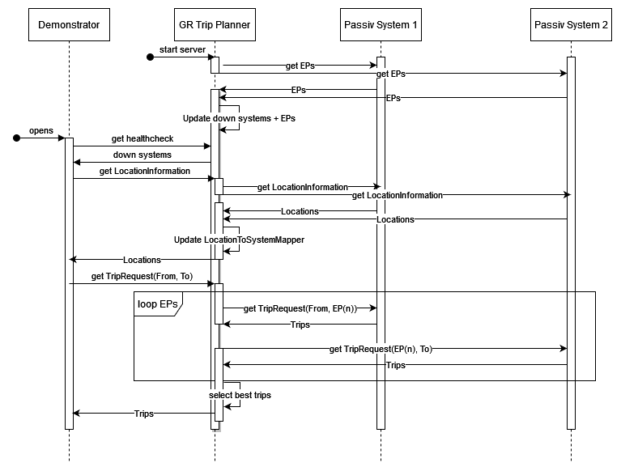

# Functionality and Structure

### APIs

This server has two APIs
- GET: /testXML/health
    - This is a healthcheck for the passive systems. This only will get the precomputed health results and not trigger a new check.
- POST: /testXML
    - This endpoint will listen to all the incoming xml-requests from the frontend. At the moment this is:
        - LocationInformationRequest
        - TripRequest
    
### Workflow

This diagram shows the shortened workflow if someone wants to drive from system 1 to system 2. Following the steps:
 - On startup of the server it will call the two system to get all the ExchangePoints(EPs) of those two systems.
   Afterwards it will compare those EPs based on the PrivateCode and save the common EPs in a list in the ExchangePoints class.
   If a system is not available it will save this information in another list of the same class.
 - After choosing `GR Test` in the demonstrator, the demonstrator will call the healthcheck-endpoint. This endpoint
   will return all the unavailable systems. So it is possible to display a warning in the frontend.
 - When the user enters more than two letters in the Location field in the demonstrator, it triggers the 
   LocationInformationRequest. For this request this application works as proxy and will call the two passive systems 
   to get the Locations from there. The application will wait on both responses, add the originSystem to all the Locations
   and send it back altogether to the demonstrator. Because the frontend does not send back the originSystem, the backend 
   has a hashMap in the NameToSystemMapper class to save the originSystem for every stopPointRef. For sure this step 
   will run multiple times and has to run at least two times for `From` and `To`. This is simplified in the diagram.
 - The last and most complicated step in the diagram is the TripRequest. After the endpoint gets the request with the origin
   and destination location it will lookup the originSystems in the NameToSystemMapper hashMap. If both locations come 
   from the same system it is easy because the backend can simply work as a proxy to this system. Else the application 
   has to perform a TripRequest from the origin location to specific EP (some metrics will be used here to select good EPs)
   against the first system. After the response from the first system the arrival time at the EPs are known and it is 
   therefore possible to perform TripRequest from those EPs to the real destination. All those responses have to be sorted 
   and the best ones will e sent back to the demonstrator.
   
### OJP SDK
For the ojp demonstrator a library was developed to handle the calls to the backend systems. For simplticitity and of 
time reasons, this library was also used for this project. Because it is written for the frontend, it can only be used 
to make the calls to the passive systems and get ts-objects back. Therefore, the incoming request is casted from xml to 
ts-objects, with these objects and the library the passive systems are called and ts-objects will come back. Afterwards 
this will be casted to xml again. For sure this needs time to do. Also, there are two more drawbacks. First it is 
not that easy to get all the needed values from the passive systems and it is not easily possible to add attributes to 
the used classes. Also, there are some calls there are not needed ion the frontend like the ExchangePointRequest. Those 
requests are now, in this project, in the ojp-sdk-extension folder. It is written like the ojp-sdk and can be integrated 
into it easily.

